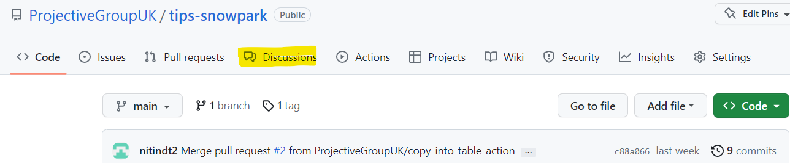
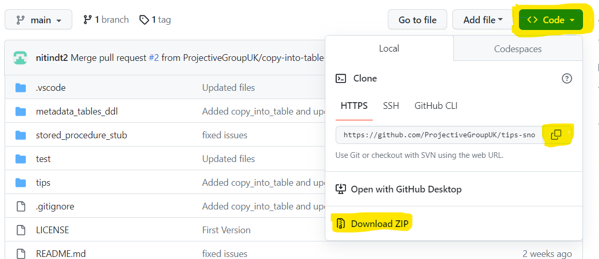

# Getting Started
Great, now that you have made your mind to give TiPS a try, let's get you started. Surely, you would find it worth giving it a try. Any feedbacks and suggestions for improvements are always welcome. Kindly add your feedbacks/suggestions using GitHub Discussions 

.

## TiPS Setup
Presumably you are currently browsing through the reposotiry on GitHub or you are on next step already by downloading the repository to your PC. If you haven't yet downloaded the repository, let's get that done first.

Please make sure you have Python installed on your PC, as you would need it, if you want to run TiPS using Snowpark Client API, or test the code base before uploading it to snowflake. If Python is not installed on your PC, it can be downloaded and installed from [Python's official website](https://www.python.org/). Recommended python version is 3.8 and over. 

### Downloading Repository
TiPS can be downloaded from [GitHub repository](https://github.com/ProjectiveGroupUK/tips-snowpark), either by cloning the repository or downloading as zip file. When on the repository page, Click on the "<> Code", as shown in yellow highlighting, in screenshot below:

.

From here you can either clone the repository to your PC, or download the source code as Zip file. 

If you have downloaded the zip file, unzip it into a local folder. Folder name can be as per your choice, however if you create it as `c:\GitHub\tips-snowpark` (on Windows) or `/GitHub/tips-snowpark` (on Unix based OS, including Mac), it would make it much easier for you to copy/paste the commands from the instructions.

### Create Python Virtual Environment
Now that you have got the code on your PC in your desired folder location, open the code in editor of your choice (e.g. VSCode or PyCharm).

Open the terminal windows from your code editor (which should ideally open the teminal in reposotiry folder)
or 
if you prefer, open command prompt/powershell (Windows) or terminal window (Linux/Mac) and navigate to repository folder.
<p>For example:</p>
* Windows - `cd C:\GitHub\tips-snowpark\`
* Linux/Mac - `cd /GitHub/tips-snowpark`
* Bash Terminal - `cd /c/GitHub/tips-snowpark/`

*It is preferable to use Bash Terminal on Windows PC, as further instructions are given using bash terminal. On Windows PC with Git installed, Git Bash should be present*

<p>Once in the terminal, run the following command to setup python virtual evironment:</p>

`$ python -m venv venv` (this would create a folder named venv in your current location)

Next run command:<br>
`$ source venv/Scripts/active` (to activate virtual environment)

Next run command:<br>
`$ pip install -r requirements.txt` (this would install all required dependencies to virtual environment)

Now your environment is all set, so we can mode to next step.

### Setup Database Objects

There is a folder named `metadata_tables_ddl`, which contains SQL scripts for database objects that are part of TiPS. Execute this scripts on Snowflake, in the order they are listed. You can run these in any schema of your choice, but if there is no particular preference, suggested schema is `TIPS_MD_SCHEMA` (create schema or use existing one, as deemed fit)

1. `process.sql`: This is DDL script for `PROCESS` table
2. `process_cmd.sql`: This is DDL script for `PROCESS_CMD` table
3. `process_log_seq.sql`: This scripts creates a sequence, needed for `PROCESS_LOG` table
4. `process_log.sql`: This is DDL script for `PROCESS_LOG` table
5. `process_dq_test.sql`: This is DDL script for `PROCESS_DQ_TEST` table. This script also populates standard DQ Test data shipped with the code.
6. `process_cmd_tgt_dq_test.sql`: This is DDL script for `PROCESS_CMD_TGT_DQ_TEST` table
7. `process_dq_log.sql`: thsi is DDL script for `PROCESS_DQ_LOG` table
8. `vw_process_log.sql` [optional]: This is script for a view to be built on PROCESS_LOG table. It flattens out the JSON Log into tabular rows for easier interpretation from within the database

Also, inside `stored_procedure_stub` folder, there are couple of scripts available. These are for stored procedures used by TiPS. Please compile `create_temporary_table.sql` script. This stored procured is needed even when we run TiPS from command line (using Snowpark Client API) 

Now that we have created Database objects required by TiPS, we are ready to move to the next step to setup our first sample pipeline to test run TiPS.

### Setup Sample Data Pipeline [optional]
To see TiPS in action after the setup, you can follow the steps below to setup a trial data pipeline without having to write anycode yourself.

For setting up a trial data pipeline, we have supplied with SQL scripts that you can run on your snowflake account. These scripts are in sample_pipeline folder under test folder, within this repository

#### Schema Script(s)
There are couple of scripts in "test -> sample_pipeline -> schema" folder. Please run these scripts to create two schemas where would setup tables and views for our pipeline. Please run both `tips_test_dimension.sql` and `tips_test_transform.sql` scripts

#### Sequence Script(s)
Next, please run the scripts abavilable in "test -> sample_pipeline -> sequence" folder

#### Table DDL Script(s)
Next, please run the scripts abavilable in "test -> sample_pipeline -> table" folder

#### View Script(s)
Next, please run the scripts abavilable in "test -> sample_pipeline -> view" folder

#### Metadata Script(s)
Finally, for setup of data pipeline, run the script abavilable in "test -> sample_pipeline -> metadata" folder. This script sets up TiPS metadata needed for execution of data pipeline

### Execute Data Pipeline (using Snowpark Client API)
Now that you have setup a trial data pipeline using table/views and metadata, it is now a good time to test whether TiPS is working as expected.

To do that please follow the steps below:
1. For executing TiPS from command line using Snowpark Client API, we will run it with `run_process_log.py` which is availabe inside test folder. However before we run that, we would need to set an environment variable on the terminal, for relative paths in imports to work properly. Please use the command below as an example and tweak as necessary according to your folder structure setup and/or OS requirement (below is the example for being run on a Bash terminal)
you would need to set PYTHONPATH enviroment variable, with path that of your github folder e.g.
```
export PYTHONPATH=/c/GitHub/tips-snowpark
```

Now navigate to test folder, if you are not already in it
```
cd /c/GitHub/tips-snowpark/test
```

And then to execute the trial pipeline that we have setup in previous steps, you can execute the command below:
```
python run_process_local.py -p TIPS_TEST_PIPELINE -v "{'COBID':'20230101', 'MARKET_SEGMENT':'FURNITURE'}" -e Y
```

With parameters:
* -p -> We are passing in Data Pipeline Name that we have setup in previous steps
* -v -> Here we are passing in the bind variable values in JSON format, that are used by our pipeline. This is an optional parameter, and is only required when bind variables are used in the pipeline
* -e -> Here we pass in Y/N flag, for indicating whether we want to execute the SQLs generated by TiPS or we just want to generate the SQLs and outputted for debugging purpose. If Y is passed then generated SQLs are executed on the database. If N is passed then generated SQLs are only outputted to the log and are not executed in the database.

Once the above command is executed and if everything has been setup correcty, you should start seeing the log messages on terminal window displaying how execution of pipeline is prgressing. You should also notice a `log` folder created inside `test` folder, where log files are generated

### Execute Data Pipeline (inside Snowflake with Stored Procedure)
