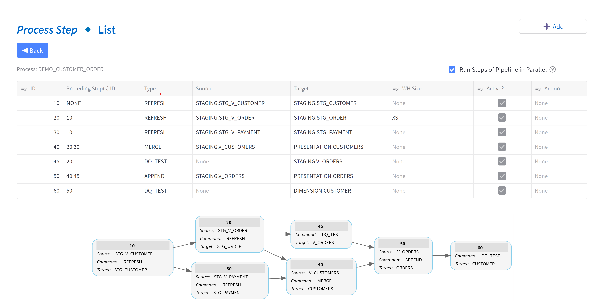

# Introduction to TiPS (Snowpark)

### What is TiPS?
TiPS is a simple data transformation and data quality framework built for Snowflake.

The ideology behind TiPS was to create a framework that an experienced database professional, already adept with SQL, could easily deliver data pipelines with virtually zero learning curve.

A unit of work in TiPS can be one of two things:

* A movement of data from a source to a target. In the majority of cases the sources are database views encapsulating transformation logic in the desired form, while the targets are database tables.
* A data quality check to make sure data being moved from source to target conforms to the desired form, before getting consumed by the data consumer and thus providing inconsistent results.

A data pipeline in TiPS is made up multiple steps or units, each performing it's own operation to move data from source to target or checking data quality (as shown below):

TiPS is also built with Data Security aspect in mind, which distinguishes it from majority of the Data Transformation tools available in the market. With TiPS, the database credentials that are used to execute the data pipeline do not require read/write priveleges to underlying database objects, hence adding an extra layer of security over the data.

### How does TiPS work?

TiPS is a simple to use Metadata driven transformation framework. All the metadata is stored in database tables in snowflake, which can easily be interogated using normal SQL commands.

All TiPS objects are first class database objects

When run in snowpark through stored procedure, TiPS provides an extra security feature where the executing user of the stored procedure doesn't need to have direct read/write priveleges on the underlying table/data. User calling the stored procedure only needs privileges to execute the stored procedure.

## Data Pipeline Related Tables

* [PROCESS](reference.md#process) - Holds information about Data Pipeline e.g. Name and Description of Data Pipeline.
* [PROCESS_CMD](reference.md#process_cmd) - This table holds information about individual steps within a data pipeline.
* [PROCESS_LOG](reference.md#process_log) - This table is populated with data pipeline execution logs when data pipelines are run through TiPS

## Data Quality Related Tables

* [PROCESS_DQ_TEST](reference.md#process_dq_log) - This table is shipped with some preconfigured DQ tests. New tests can be configured by the users themselves into this table.
* [PROCESS_CMD_TGT_DQ_TEST](reference.md#process_cmd_tgt_dq_test) - This table is configured with Linking DQ Tests to the Target (table).
* [PROCESS_DQ_LOG](reference.md#process_dq_log) - This table is populated with data quality test execution logs when data pipelines are run through TiPS. Data in this table is tied up to `PROCESS_LOG` table through  `process_log_id` column.
